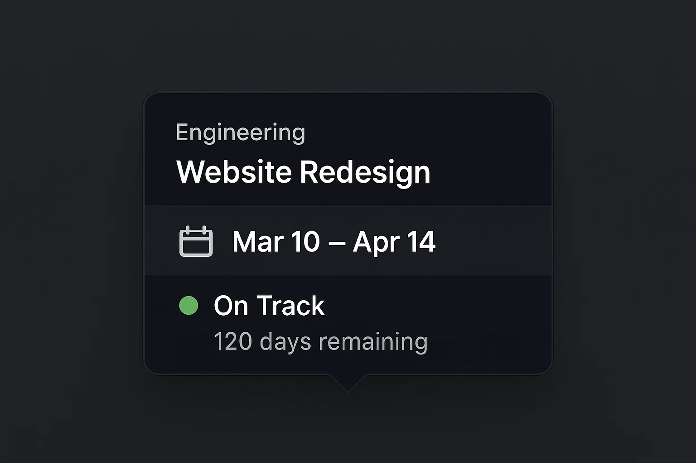

# Tooltip Component Specifications

## 📸 **Reference Design**

## 🎯 **Final Approved Design**
This is the EXACT tooltip design approved for implementation.

### **Key Features**
- ✅ **Enhanced information hierarchy** with calendar icon
- ✅ **Background highlight** for CP/date section
- ✅ **Bold typography** for critical information (CP3.5 and dates)
- ✅ **Green status indicator** for quick visual confirmation
- ✅ **Professional dark theme** suitable for executive presentations

## 🛠️ **Implementation Requirements**

### **P0 - Must Haves (Week 1 PoC)**
- ✅ **Dark tooltip container** (#1F2937 background)
- ✅ **Information hierarchy:**
  - Team name (13px regular white)
  - Project name (13px regular white)
  - **📅 CP3.5: Feb 1 - Feb 15, 2025** (15px bold, highlighted background)
  - Status: ● On Track (13px regular with green dot)
  - Duration: 14 days (12px, slight opacity)
- ✅ **Calendar icon** in highlighted section
- ✅ **Subtle background bar** behind CP/date information
- ✅ **Show/hide on hover** functionality
- ✅ **Proper pointer arrow** pointing to timeline segment

### **P1 - Nice to Haves (Future)**
- 🎨 **Light mode variant** (same hierarchy, light colors)
- ⚡ **Smooth fade transitions** (200ms in/out)
- 🎯 **Smart positioning** (auto-flip near edges)
- 📱 **Touch-friendly** larger hit targets (future mobile)

## 📐 **Exact Measurements**
- **Container width**: 280px maximum
- **Padding**: 14px vertical, 18px horizontal
- **Border radius**: 8px
- **Drop shadow**: 0 10px 25px rgba(0,0,0,0.3)
- **Highlighted section**: 4px extra spacing, #374151 background
- **Typography**: Inter font family throughout

## 🎨 **Color Specifications**
- **Background**: #1F2937 (dark charcoal)
- **Text**: #FFFFFF (white)
- **Highlighted section**: #374151 (lighter charcoal)
- **Status indicator**: #10B981 (green)
- **Duration text**: rgba(255,255,255,0.8) (white with opacity)

## 💻 **Development Notes**
- Use this exact visual as implementation reference
- Calendar icon can be Unicode 📅 or small SVG
- Background highlight should span full width of highlighted section
- Maintain exact spacing and typography hierarchy shown

---
*This design was finalized on implementation planning and represents the approved tooltip component for the CP Gantt visualization.*
